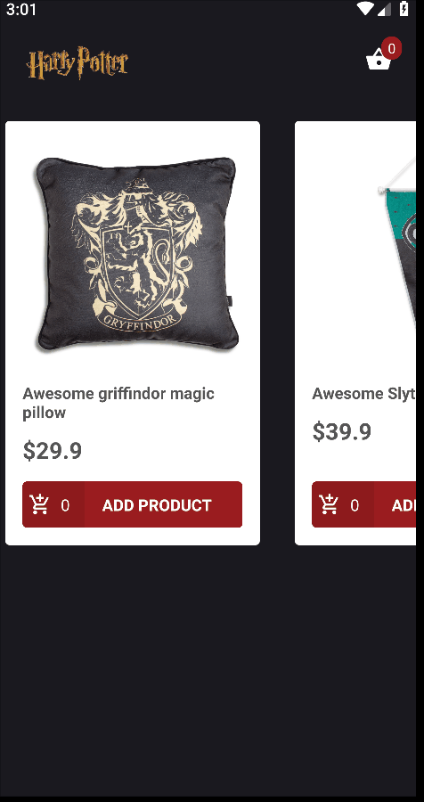

<h1 align="center">Welcome to potterStore 👋</h1>

  
  

> React navite potter store application :)

> A study pourpose React native application

  

## Install

* To install and use this application follow the React native get started [documentation](https://facebook.github.io/react-native/docs/getting-started)
* **Important** follow the instructions listed on the _React Native CLI quickstart_
* install [json server](https://github.com/typicode/json-server)
* After you have your development environment set up, open `src/services/api.js` and set your IP addrs and a port to run the **json server**  then run `json-server --host YOURIPADDR -p PORT api.json` at the root folder of the application

## Author

👤 **Lucas Henrique Procopio  **

* Twitter: [@LucasHProcopio](https://twitter.com/LucasHProcopio)
* Github: [@LucasProcopio](https://github.com/LucasProcopio  )

## Show your support

Give a ⭐️ if this project helped you!

***
